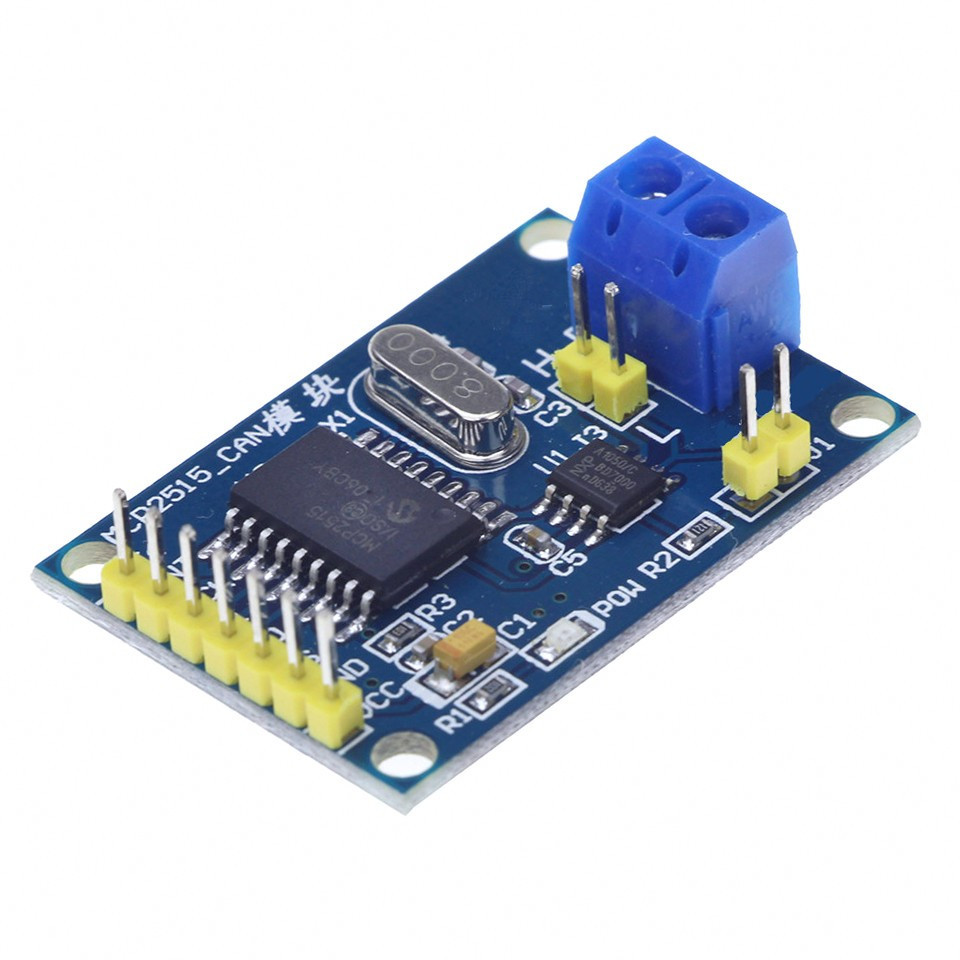
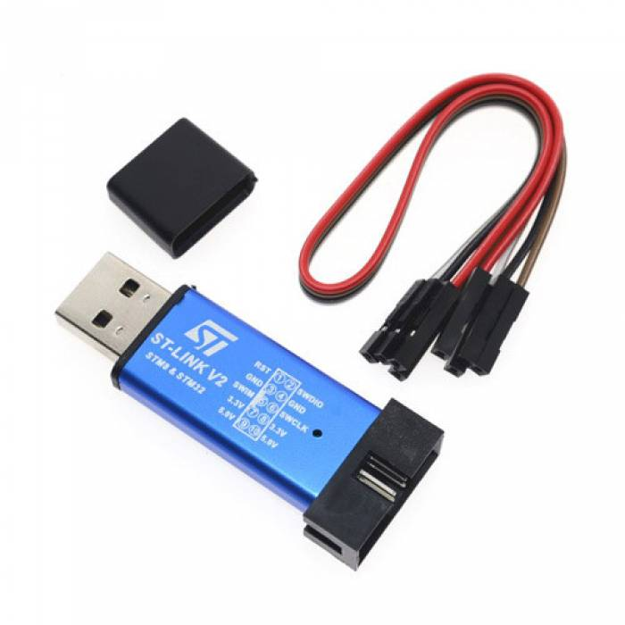
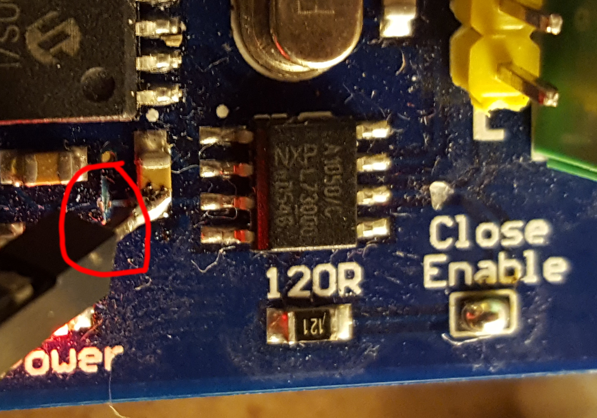

This document describes how the STM32F0 port operates and how to work with
tiny CAN-enabled boards.

Required components
===================

#### MCP2515 module



#### St-link dongle




Adding CAN bus to Raspberry Pi
==============================
(Based on Quick Guide https://www.raspberrypi.org/forums/viewtopic.php?f=44&t=141052)

First of all, it’s necessary to modify the CAN-module from ebay, because it has
only one VCC pin, but the MCP2515 needs to be powered from 3V3 and the TJA1050
CAN-transceiver needs to be powered from 5V. Powering both chips from 5V would
work, but then a level-shifter for the SPI would be needed. The Pi's GPIO pins
are NOT 5V tolerant. Cut a trace on the PCB and soldered a pin onto the trace
to deliver 5V only to the TJA1050. Be sure to cut the trace before the capacitor:



Next connect the module:

| MCP2515 | Raspberry Pi |
| --- | --- |
| VCC | 1 (3V3) |
| TJA 1050 VCC | 2 (5V) |
| GND | 6 (GND) |
| CS | 24 (CE0) |
| MISO | 21 (MISO) |
| MOSI | 19 (MOSI) |
| SCK | 23 (SCK) |
| INT | 22 (GPIO25) |

Install can-utils:
> sudo apt-get install can-utils

To activate the driver for the MCP2515 you have to add a kernel overlay, to do
so edit the /boot/config.txt
> sudo nano /boot/config.txt

And add the following lines (set oscillator value according to crystal on your board):

```
dtparam=spi=on
dtoverlay=mcp2515-can0,oscillator=8000000,interrupt=25
dtoverlay=spi1-1cs
```

Now reboot, after the reboot try to setup the the can interface:
> sudo ip link set can0 up type can bitrate 500000

If no errors occurred, the can interface should be ready now.
To make the CAN-interface permanent, add the following lines to /etc/network/interfaces

```
auto can0
iface can0 can static
    bitrate 500000
```

Communicating over CAN
======================

Use "Serial over CAN" emulator software to establish connection:
https://github.com/Delsian/CanSerial

Install st-link on Raspberry Pi
===============================

> sudo apt-get update

> sudo apt-get install cmake

> sudo apt-get install libusb-1.0-0-dev

> git clone https://github.com/texane/stlink stlink-repo

> cd stlink-repo

> make

> cd build/Release/

> sudo make install


Copy to /etc/udev/rules.d/49-stlinkv2.rules:

```
# stm32 discovery boards, with onboard st/linkv2
# ie, STM32L, STM32F4.
# STM32VL has st/linkv1, which is quite different

SUBSYSTEMS=="usb", ATTRS{idVendor}=="0483", ATTRS{idProduct}=="3748", \
    MODE:="0666", \
    SYMLINK+="stlinkv2_%n"

SUBSYSTEMS=="usb", ATTRS{idVendor}=="0483", ATTRS{idProduct}=="374b", \
    KERNEL!="sd*", KERNEL!="sg*", KERNEL!="tty*", SUBSYSTEM!="bsg", \
    MODE:="0666", \
    SYMLINK+="stlinkv2_%n"

SUBSYSTEMS=="usb", ATTRS{idVendor}=="0483", ATTRS{idProduct}=="374b", \
    KERNEL=="sd*", MODE:="0666", \
    SYMLINK+="stlinkv2_disk"

SUBSYSTEMS=="usb", ATTRS{idVendor}=="0483", ATTRS{idProduct}=="374b", \
    KERNEL=="sg*", MODE:="0666", \
    SYMLINK+="stlinkv2_raw_scsi"

SUBSYSTEMS=="usb", ATTRS{idVendor}=="0483", ATTRS{idProduct}=="374b", \
    SUBSYSTEM=="bsg", MODE:="0666", \
    SYMLINK+="stlinkv2_block_scsi"

SUBSYSTEMS=="usb", ATTRS{idVendor}=="0483", ATTRS{idProduct}=="374b", \
    KERNEL=="tty*", MODE:="0666", \
    SYMLINK+="stlinkv2_console"

# If you share your linux system with other users, or just don't like the
# idea of write permission for everybody, you can replace MODE:="0666" with
# OWNER:="yourusername" to create the device owned by you, or with
# GROUP:="somegroupname" and control access using standard unix groups.
```

Now "make flash" command can upload HEX into connected board

Pins allocation
===============

Configurations with CAN and Serial port uses different pins, and firmware contains only
actual pins initialization.
